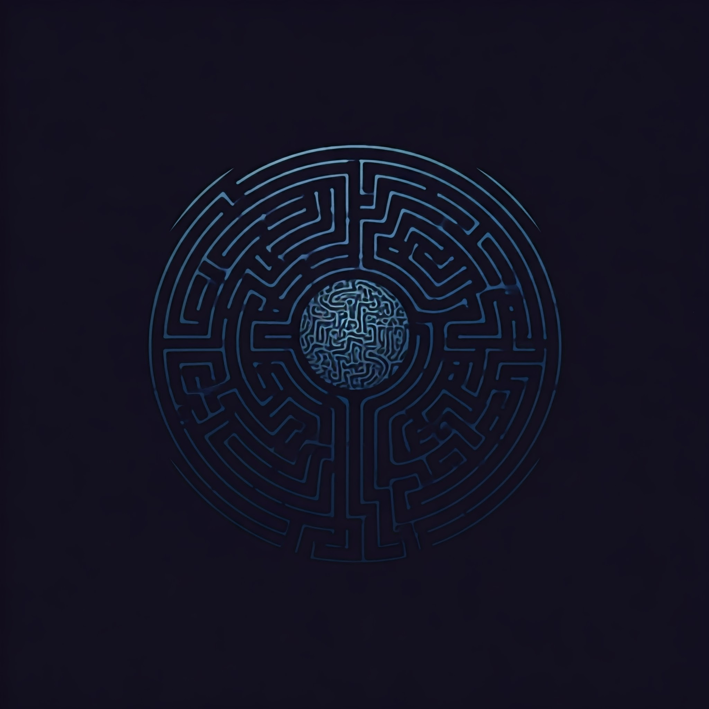

<p align="center">
  
</p>

<h1 align="center">Labyrintho</h1>

<p align="center">
  Labyrintho is a UI to apply segmentation in seismic facies
</p>
<p align="center">
  <strong>Version 0.0.1</strong>
</p>

## About this project

**Labyrintho** is a user interface (UI) developed for seismic facies segmentation. This tool is a experiment for task of seismic segmentation, and in the future, can be auxiliate geophisics and students in this area.

## How to run
1. Clone this repository:
   ```bash
   git clone https://github.com/filipeas/labyrintho.git

2. Execute ``` setup.sh ``` to create a venv and install all dependences. This will create **labyrintho_env**.

3. Set labyrintho's env and run ``` python main.py ```.

### Requirements
- numpy
- matplotlib
- PyQt5
- opencv-python
- tifffile